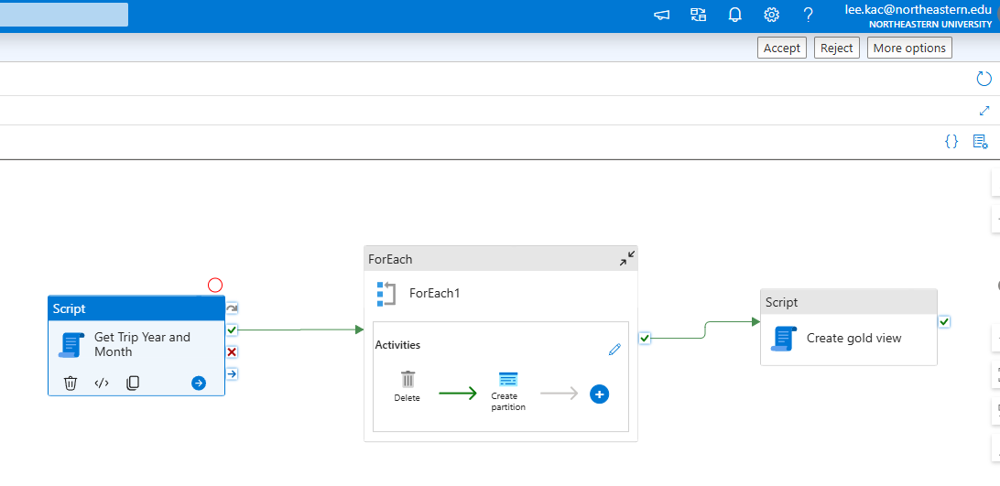
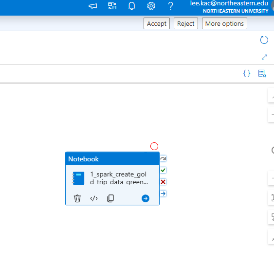
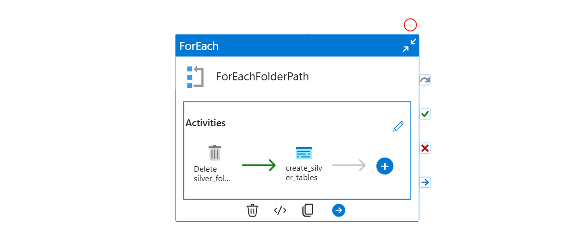

# Azure Synapse NYC Taxi Project

## Project Overview
The pipelines are categorized into silver and gold tables for better data organization and reporting.

## Pipeline Overview

### 1. Master Data Pipeline
This pipeline orchestrates the complete data flow, ensuring data integrity and efficient transformations.

### 2. Pipeline for Gold Table Aggregation
This pipeline aggregates data for gold tables to optimize Power BI reporting and analytics.

### 3. Pipeline Notebook for Aggregating Trip Data (Green Taxis)
This notebook processes and aggregates trip data for green taxis, applying necessary transformations.

### 4. Pipeline for Each Silver Table
A dedicated pipeline handles the transformation and loading of individual silver tables.

### 5. Pipeline for Transaction Silver Table
This pipeline processes transactional data for silver tables, ensuring structured and clean data.

## Summary
These pipelines support efficient data ingestion, transformation, and reporting in the Azure
